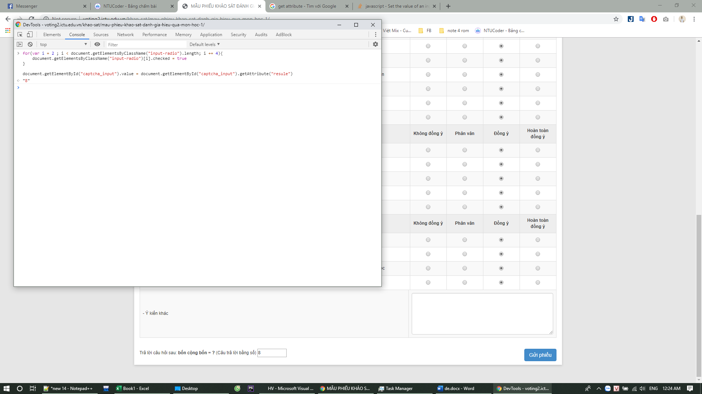

# Hướng dẫn Vote auto
1. F12 pate đoạn code js vào phần "Console"
    ```javascript
    for(var i = 2 ; i < document.getElementsByClassName("input-radio").length; i += 4){
    	document.getElementsByClassName("input-radio")[i].checked = true;
    }
    document.getElementById("captcha_input").value = document.getElementById("captcha_input").getAttribute("resule");
    ```
2. xong
    